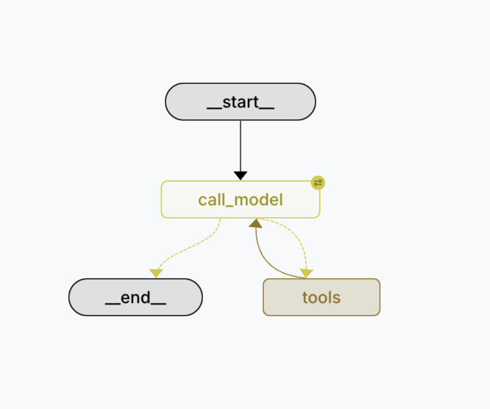
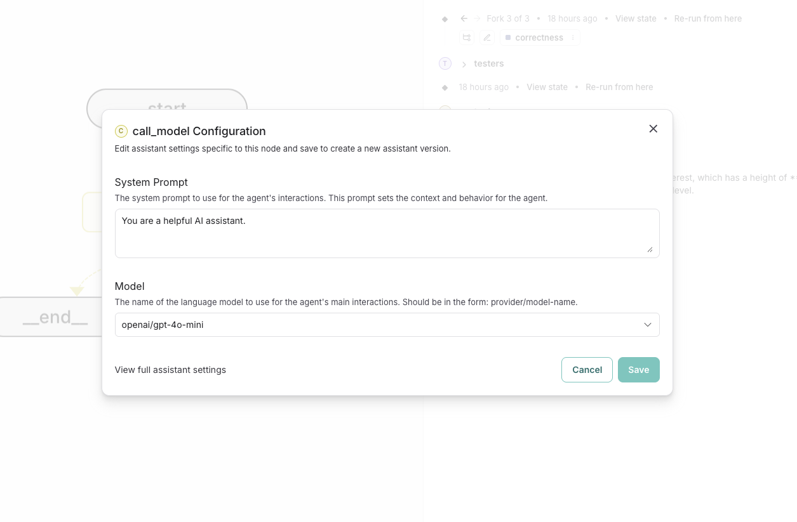

# Prompt Engineering in LangGraph Studio

## Overview

A central aspect of agent development is prompt engineering. LangGraph Studio makes it easy to iterate on the prompts used within your graph directly within the UI.

## Setup

The first step is to define your [configuration](https://langchain-ai.github.io/langgraph/how-tos/configuration/) such that LangGraph Studio is aware of the prompts you want to iterate on and which nodes they are associated with.

For example, if you have a node called `call_model` whose system prompt you want to iterate on, you can define a configuration like the following:

```python
from pydantic import BaseModel, Field
from typing import Annotated, Literal

class Configuration(BaseModel):
    """The configuration for the agent."""

    system_prompt: str = Field(
        default="You are a helpful AI assistant.",
        description="The system prompt to use for the agent's interactions. "
        "This prompt sets the context and behavior for the agent.",
        json_schema_extra={
            "langgraph_nodes": ["call_model"],
            "langgraph_type": "prompt",
        },
    )

    model: Annotated[
        Literal[
            "anthropic/claude-3-7-sonnet-latest",
            "anthropic/claude-3-5-haiku-latest",
            "openai/o1",
            "openai/gpt-4o-mini",
            "openai/o1-mini",
            "openai/o3-mini",
        ],
        {"__template_metadata__": {"kind": "llm"}},
    ] = Field(
        default="openai/gpt-4o-mini",
        description="The name of the language model to use for the agent's main interactions. "
        "Should be in the form: provider/model-name.",
        json_schema_extra={"langgraph_nodes": ["call_model"]},
    )
```

Specifically, note that the `json_schema_extra` field where `"langgraph_nodes": ["call_model"]` indicates that the `system_prompt` and `model` fields will be used to configure the `call_model` node and that the `"langgraph_type": "prompt"` indicates that the `system_prompt` field is a prompt.

## Iterating on prompts

### Node Configuration

With this set up, running your graph and viewing in LangGraph Studio will result in the graph rendering like such.

**Note the configuration icon in the top right corner of the `call_model` node**:

{width=1200}

Clicking this icon will open a modal where you can edit the configuration for all of the fields associated with the `call_model` node. From here, you can save your changes and apply them to the graph. Note that these values reflect the currently active assistant, and saving will update the assistant with the new values.

{width=1200}

### Playground

LangGraph Studio also supports prompt engineering through an integration with the LangSmith Playground. To do so:

1. Open an existing thread or create a new one.
2. Within the thread log, any nodes that have made an LLM call will have a "View LLM Runs" button. Clicking this will open a popover with the LLM runs for that node.
3. Select the LLM run you want to edit. This will open the LangSmith Playground with the selected LLM run.

{width=1200}

From here you can edit the prompt, test different model configurations and re-run just this LLM call without having to re-run the entire graph. When you are happy with your changes, you can copy the updated prompt back into your graph.

For more information on how to use the LangSmith Playground, see the [LangSmith Playground documentation](https://docs.smith.langchain.com/prompt_engineering/how_to_guides#playground).
